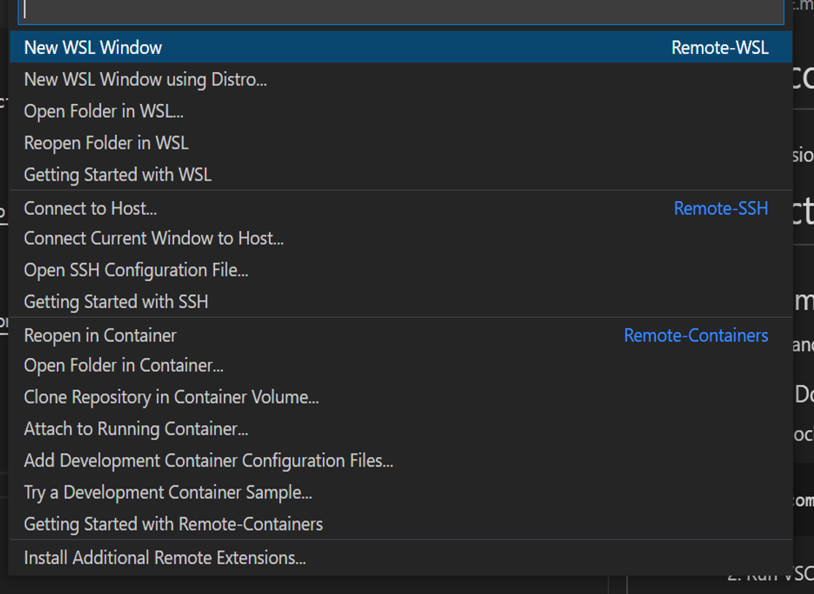
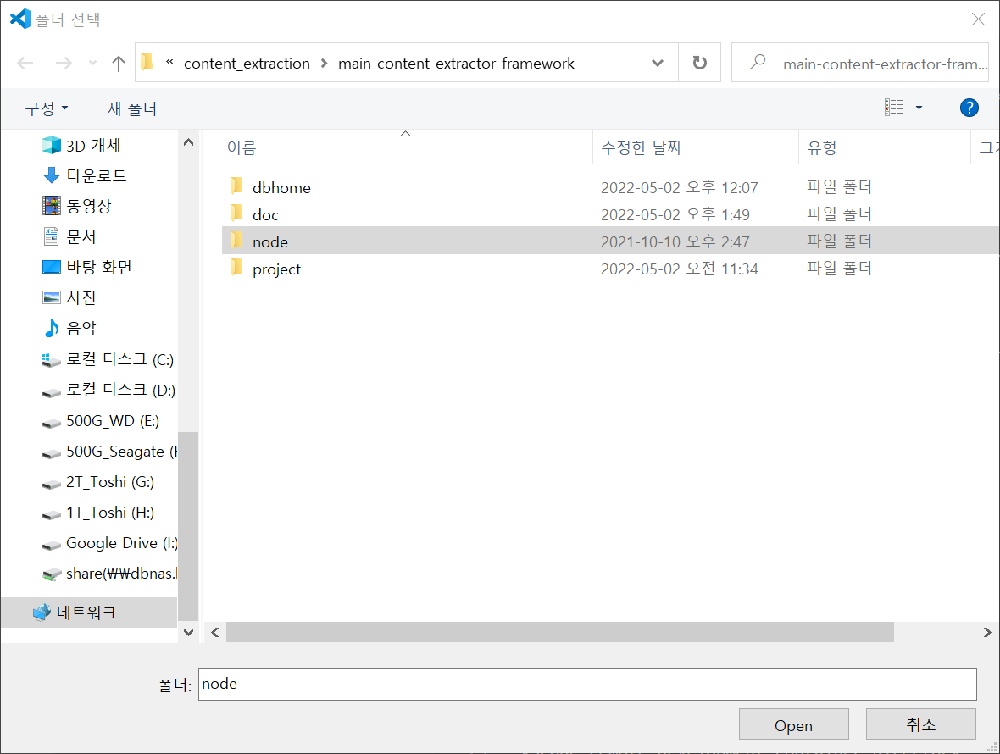

# Main content extraction Framework
**(!NOTICE!) If you looking for the Grid, Centering, and Expanding (GCE) implimentation, available here: https://gitlab.com/dreamwayjgs/main-content-extractor-v2**


 A WebExtension based framework for the assessment of Main Content Extraction Methods from web pages. This framework provides four steps to assess the main content extraction methods:
   1. Crawling web pages
   1. Curation: Annotating and labeling web pages.
   1. Extraction: Run the main content extraction methods on the web pages.
   1. Evaluation: Evaluate the extraction result by comparing with the ground truth.

 This repository contains the framework with the demo backend server (in <code>/project/api</code> folder).

# Instructions
## Run Readability.js example (Quickstart)
1. Run docker containers with [docker-compose](https://docs.docker.com/compose/). You can use <code>.env</code> file to configure the docker containers.
```
docker-compose up
```
1. In the nodejs container, [run the backend server.](/src/project/api/README.md)
1. [Build browser extension.](/src/project/chrome_extension/README.md)

## Development environments
We recommand [VSCode Remote Containers feature](https://code.visualstudio.com/docs/remote/containers) to use this framework. Or you need [nodejs](https://nodejs.org/en/download/) >= 14.

### VSCode + Docker
1. Run docker containers with [docker-compose](https://docs.docker.com/compose/). You can use <code>.env</code> file to configure the docker containers.
```
docker-compose up
```
2. Run VSCode remote containers
    - Open VSCode in root directory
    - Click on "Open a Remote Window" in the botton right conner.

     

    - Select "Open Folder in Container..." in the dropdown menu.

    

    - Select the "node" folder in root directory and click "open" in the dialog box. (Click open button, NOT doubleclick folder.)

    
3. Implement your functions in the <code>src/project/chrome_extension</code> folder.
    - You can get examples by finding <code>// EXAMPLE</code> and <code>// TODO:</code> in <code>*.ts</code> files.

# Directories
## /project
Main project directory. For project details see README.md in this directory.

## /dbhome
Docker shared volume directory for database containers (MongoDB, Postgresql).

## /node
VSCode remote development container directory.

## docker-compose.yml
Docker compose file for development server and databases.

## .env
Environment variables for the docker-compose.yml.

# Demo Datasets

Download Mirror [Figshare](https://figshare.com/s/7043152c37d35edb3c15)

## Descrption
|Name|URLs|Sampled|Saved|Readable|
|:----|:----|:----|:----|:----|
|GoogleTrends-2017|12720|400|390|285|
|GoogleTrends-2020|10560|400|388|240|
|GoogleTrends-2020-KR|296|50|43|21|
|GoogleTrends-2020-JP|450|50|47|24|
|GoogleTrends-2020-ID|900|50|50|31|
|GoogleTrends-2020-FR|1580|100|97|39|
|GoogleTrends-2020-RU|890|100|95|48|
|GoogleTrends-2020-SA|260|100|97|43|
|baidu-2020 (CN)|1990|200|193|53|

1. Get keywords from GoogleTrends and Baidu.
    - 2020: https://trends.google.com/trends/yis/2020/GLOBAL/        
    - 2017: https://trends.google.com/trends/yis/2017/GLOBAL/
    - baidu: https://baijiahao.baidu.com/s?id=1686016936405463174
1. Query the keywords to Google (or Baidu) and take top 100 links (URLs).
1. Randomly sampled from the URLs and crawled the pages (Sampled).
1. Successfully crawled pages (Saved).
    - Broken links, 404, etc. are not saved.
1. Readable pages (Readable).
    - At least one 'maincontent' tagged element by annotators.
    - If the annotators thought any readable main content (text) existed on the page, they determined it was readable.
    - Global, KR, JP, CN: Annotated by native speakers or who can read the language.
    - Others: Annotated by Korean speakers.


## Postgres
It contains raw HTML strings. The PK can retrieved from the Stored Collection in the MongoDB below.

[Download here](https://dbnas.hanyang.ac.kr/s/KH7t9w8sY6RxxBQ/download)

Dumping example:

    pg_dump --quote-all-identifiers -Fc maincontent > maincontent_pg.dump

Restore example:

    pg_restore -d maincontent maincontent_pg.dump


## Mongodb
It contains data and metadata except raw data (Postgresql) and MHTML files.

[Download here](https://dbnas.hanyang.ac.kr/s/9rcMqA9pwG5pFzm/download)

Dumping example:

    mongodump --gzip --archive > maincontent_mg.gz.dump

Dumping from mongodb database in docker container example:

    docker exec -it <mongodb_container_name> mongodump --gzip --archive > maincontent_mg.gz.dump

Restore example:

    mongorestore --gzip --archive=maincontent_pg.dump


## MHTML files
It contains MHTML files for documents from <code>Webpage</code> collection in the MongoDB.

[Download here](https://dbnas.hanyang.ac.kr/s/RgmH5i6SC4EndKW)

Restore this folder to your api's static serve directory. In our demo server, it is <code>/src/project/api/static/mhtml</code>.

Restore example:

    tar -zxf maincontent_mhtml.tar.gz