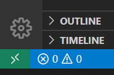
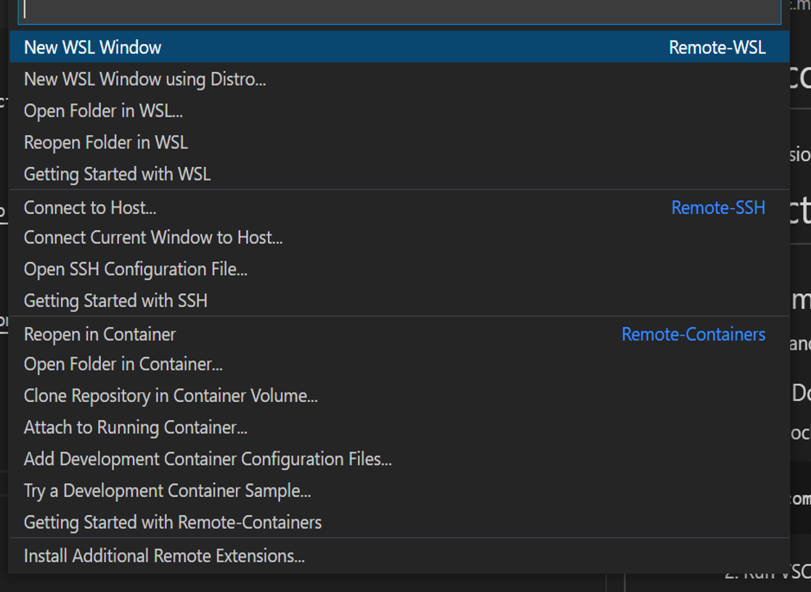

# Main content extraction Framework
 A WebExtension based framework for the assessment of Main Content Extraction Methods from web pages. This framework provides four steps to assess the main content extraction methods:
   1. Crawling web pages
   1. Curation: Annotating and labeling web pages.
   1. Extraction: Run the main content extraction methods on the web pages.
   1. Evaluation: Evaluate the extraction result by comparing with the ground truth.

 This repository contains the framework with the demo backend server (in <code>/project/api</code> folder).

# Instructions
## Development environments
We recommand [VSCode Remote Containers feature](https://code.visualstudio.com/docs/remote/containers) to use this framework. Or you need [nodejs](https://nodejs.org/en/download/) >= 14.

### VSCode + Docker
1. Run docker containers with [docker-compose](https://docs.docker.com/compose/). You can use <code>.env</code> file to configure the docker containers.
```
docker-compose up
```
2. Run VSCode remote containers
    - Open VSCode in root directory
    - Click on "Open a Remote Window" in the botton right conner.

     

    - Select "Open Folder in Container..." in the dropdown menu.

    

    - Select the "node" folder in root directory and click "open" in the dialog box. (Click open button, NOT doubleclick folder.)

    

# Directories
## /project
Main project directory. For project details see README.md in this directory.

## /dbhome
Docker shared volume directory for database containers (MongoDB, Postgresql).

## /node
VSCode remote development container directory.

## docker-compose.yml
Docker compose file for development server and databases.

## .env
Environment variables for the docker-compose.yml.

# Demo Datasets
## Postgres

[Download here](https://dbnas.hanyang.ac.kr/s/KH7t9w8sY6RxxBQ/download)

Dumping example:

    pg_dump --quote-all-identifiers -Fc maincontent > maincontent_pg.dump

Restore example:

    pg_restore -d maincontent maincontent_pg.dump


## Mongodb

[Download here](https://dbnas.hanyang.ac.kr/s/9rcMqA9pwG5pFzm/download)

Dumping example:

    mongodump --gzip --archive > maincontent_mg.gz.dump

Dumping from mongodb database in docker container example:

    docker exec -it <mongodb_container_name> mongodump --gzip --archive > maincontent_mg.gz.dump

Restore example:

    mongorestore --gzip --archive=maincontent_pg.dump